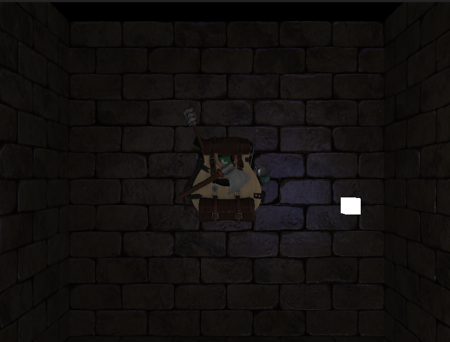

# MODELLO STATICO
L'obbiettivo di questa esercitazione è di caricare diversi modelli statici, modellare diversi tipi di luce (eventualmente movimentare i punti-luce) ed effettuarne il calcolo nel tangent space.

# MODELLI
I modelli scelti  sono:
* backpack (dall'esercitazione 14-Model)
* Wall (dall'esercitazione 16-NormalMapping)
* Cube (che rappresenta i punti luce)

# LUCI
Sono stati modellati i diversi tipi di luce proposti nell'esercitazione 13-MultipleLigths:
* luce direzionale
* punto luce
* torcia

Il punto luce inoltre è movimentato dall'alto in basso per poter apprezzare meglio gli effetti del ligthing sullo zainetto e sui muri.

# CALCOLO LIGTHING
Il calcolo dei diversi tipi di luce è lo stesso che è stato implementato nell'esercitazione 16-NormalMapping dove, oltre al calcolo del punto luce previsto dall'esercitazione, ho implementato anche il calcolo della luce direzionale e della torcia nel tangent space. Il codice (per quanto riguarda il fragment shader) è praticamente lo stesso dell'esercitazione 13-MultipleLigths, ma stavolta tutti i vettori che vengono passati in input alle funzioni che calcolano la luce sono nel tangent space. In particolare:
* la normale viene presa dalla normal-map
* la direzione della luce direzionale viene passata dal vertex shader (dove è stata moltiplicata per la matrice TBN). Allo stesso modo, la direzione della torcia viene passata dal vertex shader.
* la posizione del punto luce viene passata dal vertex shader (dove è stata moltiplicata per la matrice TBN). Allo stesso modo, la posizione della torcia viene passata dal vertex shader.
* la posizione di ogni frammento viene passata dal vertex shader (dove è stata moltiplicata per la matrice TBN)

# RISULTATO

